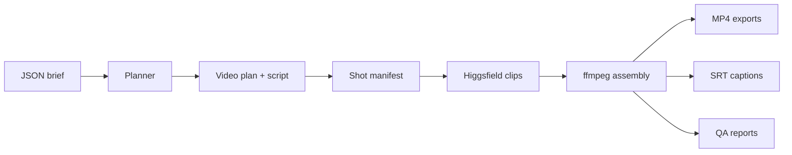

# Reelwright

**Turn a video idea into a structured AI production run from the terminal.**

Reelwright is a CLI-first AI video production pipeline for Higgsfield and
ffmpeg. It turns a JSON creative brief into a video plan, script, shot manifest,
generation jobs, platform-ready exports, captions, and QA reports.

```text
brief.json -> video-plan.json -> shot-manifest.json -> Higgsfield clips -> ffmpeg exports -> captions + QA
```

The project is built for local use. By default, planning is deterministic: the
CLI validates the JSON brief and expands it through built-in templates, so
`plan` does not call Higgsfield, ffmpeg, or an LLM. Optional local LLM planning
is available through Ollama or LM Studio. Full rendering uses Higgsfield and
ffmpeg.

## Why Use It

- Start with a repeatable brief instead of one-off generation prompts.
- Inspect the script, timing, shot list, and prompts before spending credits.
- Generate clips through Higgsfield, then assemble exports with ffmpeg.
- Keep captions, QA reports, and project state on disk for review and resume.

## Try It Without Credits

```bash
git clone https://github.com/v0idum/reelwright reelwright
cd reelwright
npm install
npm run demo:plan
```

`demo:plan` is safe to run first. It writes planning artifacts under
`projects/ai-video-workflow-demo/` without calling Higgsfield, ffmpeg, or an
LLM.

You will get:

```text
projects/ai-video-workflow-demo/
  video-plan.json
  script.md
  shot-manifest.json
```

Example shot from the generated manifest:

```json
{
  "id": "shot-001",
  "scene": "Opening",
  "durationSeconds": 7,
  "model": "kling3_0",
  "shotRole": "hook",
  "status": "planned",
  "generation": {
    "resolution": "720p"
  }
}
```

## Workflow



Planning has two modes:

| Mode | What happens | External calls |
| --- | --- | --- |
| `template` | Built-in templates turn the brief into a plan and manifest. | None |
| `local_llm` | Ollama or LM Studio drafts the structured plan, then Reelwright validates it. | Local LLM only |

## Full Render

To check the full media toolchain:

```bash
npm run doctor
```

To run the full sample pipeline after the required tools are installed and
authenticated:

```bash
npm run demo:run
```

`demo:run` can call Higgsfield and may spend generation credits.

The sample brief uses the macOS placeholder voiceover mode. On Linux or
Windows, switch `voiceover.mode` to `provided_audio` or `local_tts` before full
assembly.

## What It Does

- Reads strict JSON briefs from `briefs/`.
- Creates `video-plan.json`, `script.md`, and `shot-manifest.json`.
- Generates planned clips through the Higgsfield CLI.
- Assembles 16:9 YouTube and 9:16 Shorts/Reels/TikTok exports with ffmpeg.
- Produces SRT captions.
- Writes machine-readable and Markdown QA reports.
- Keeps project state on disk so interrupted runs can be inspected and resumed.

## What You Can Build

- Prototyping Higgsfield-based video workflows from repeatable briefs.
- Turning short-form ideas into a shot manifest before spending generation
  credits.
- Batch-generating clips, captions, exports, and QA artifacts from one local
  CLI.
- Inspecting or adapting a practical ffmpeg assembly pipeline for AI-generated
  video.
- Short-form explainers, product demos, UGC-style ads, tutorials, and social
  video experiments.

## Requirements

Core:

- Node.js 20, pinned by `.nvmrc`.
- npm.

For full media generation:

- ffmpeg and ffprobe available on `PATH`.
- Higgsfield CLI installed and authenticated.
- A Higgsfield account with access to the model used by your brief.

Optional voiceover modes:

- `local_placeholder` uses macOS `/usr/bin/say`.
- `local_tts` uses local MLX-Audio/Kokoro tooling.
- `provided_audio` uses an audio file path from the brief.

Template planning-only commands do not require Higgsfield, ffmpeg, an LLM, or
voiceover tooling. Local LLM planning requires a running Ollama or LM Studio
server, but still does not call Higgsfield.

## Higgsfield Setup

Install and authenticate the Higgsfield CLI before running commands that
generate media:

```bash
higgsfield --help
higgsfield auth status
```

Reelwright invokes Higgsfield with commands shaped like:

```bash
higgsfield generate create <model> \
  --prompt "<shot prompt>" \
  --duration <seconds> \
  --aspect_ratio 16:9 \
  --wait \
  --json
```

For Kling 3.0 and Seedance 2.0, Reelwright keeps requests within the duration
caps used by the pipeline.

## Commands

```bash
npm run doctor
npm run demo:plan
npm run demo:run
npm run reelwright -- --help
npm run reelwright -- plan <brief.json>
npm run reelwright -- run <brief.json>
npm run reelwright -- director-mvp <brief.json>
npm run reelwright -- mvp <brief.json>
```

Command notes:

- `doctor` checks Node, ffmpeg, ffprobe, and Higgsfield CLI availability.
- `demo:plan` runs the neutral sample brief through deterministic template
  planning only.
- `demo:run` runs the neutral sample brief through the full pipeline.
- `plan` writes planning artifacts only and does not spend Higgsfield credits.
  With `planning.mode: "template"`, it is fully deterministic. With
  `planning.mode: "local_llm"`, it calls only your local Ollama or LM Studio
  server.
- `run` is the current director pipeline.
- `director-mvp` is a backwards-compatible alias for `run`.
- `mvp` runs the older MVP pipeline.

## Output

Each run writes project state under `projects/<slug>/`:

- `video-plan.json` - structured plan, scenes, beats, timing, and continuity.
- `script.md` - readable script generated from the plan.
- `shot-manifest.json` - generation-ready shot list.
- `media/generated/` - downloaded Higgsfield clips.
- `media/voiceover/` - generated or provided voiceover assets.
- `exports/` - rendered MP4 and SRT files.
- `reports/` - QA reports for rendered exports.

Runtime output is ignored by Git by default.

## Examples

The `examples/` directory contains small redacted artifacts for the neutral demo
brief:

- `examples/ai-video-workflow-demo/video-plan.json`
- `examples/ai-video-workflow-demo/shot-manifest.json`
- `examples/ai-video-workflow-demo/qa-report.json`

These files show the shape of Reelwright output without generated media, signed
download URLs, local machine paths, or account-specific identifiers.

## Brief Format

Briefs are JSON files. Minimal example:

```json
{
  "topic": "AI video workflow demo",
  "audience": "creators and operators building repeatable video systems",
  "platforms": ["youtube", "shorts"],
  "language": "en",
  "tone": "clear, practical, modern",
  "cta": "Turn one repeatable content idea into a structured video workflow",
  "targetDurationSeconds": 90,
  "videoType": "guide",
  "planning": { "mode": "template" },
  "generationDefaults": { "model": "kling3_0", "resolution": "720p" },
  "voiceover": { "mode": "local_placeholder" }
}
```

Supported `videoType` values include `explainer`, `guide`, `tutorial`,
`promo_ad`, `product_demo`, `story_episode`, `ugc_ad`, `documentary_short`, and
`social_short`.

## Voiceover

Choose one voiceover mode in the brief:

```json
{ "voiceover": { "mode": "local_placeholder" } }
```

Uses macOS `say`. Useful for quick local tests on macOS.

```json
{ "voiceover": { "mode": "provided_audio", "audioPath": "audio/voiceover.wav" } }
```

Uses a pre-recorded audio file.

```json
{
  "voiceover": {
    "mode": "local_tts",
    "engine": "mlx_audio",
    "model": "mlx-community/Kokoro-82M-4bit",
    "voice": "af_heart"
  }
}
```

Uses local open-model TTS.

## Local LLM Planning

Template planning is the default. It turns the brief into a structured video
plan using code and built-in templates, with no model call.

Briefs can also use a local LLM planner when you want Ollama or LM Studio to
draft the structured plan:

```json
{
  "planning": {
    "mode": "local_llm",
    "provider": "ollama",
    "model": "qwen2.5:7b",
    "temperature": 0.3
  }
}
```

The local planner asks the model for structured JSON, extracts the first valid
JSON object, and rejects output that does not match the `VideoPlan` schema. It
does not call Higgsfield or spend generation credits; those only happen during
full rendering commands such as `run` or `demo:run`.

## Architecture

- `src/cli.ts` parses commands and routes pipeline actions.
- `src/domain/` holds schemas and project file helpers.
- `src/planning/` creates plans, scripts, and manifests.
- `src/higgsfield/` wraps Higgsfield command execution and media URL parsing.
- `src/audio/` handles placeholder, local TTS, and provided voiceover modes.
- `src/ffmpeg/` builds assembly and probing commands.
- `src/qa/` writes render and creative QA reports.
- `tests/` covers planning, generation boundaries, ffmpeg arguments, captions,
  resume behavior, and QA.

## Credit Safety

These commands do not call Higgsfield:

```bash
npm test
npm run typecheck
npm run validate
npm run demo:plan
npm run reelwright -- plan <brief.json>
```

These commands can call Higgsfield and may spend credits:

```bash
npm run demo:run
npm run reelwright -- run <brief.json>
npm run reelwright -- director-mvp <brief.json>
npm run reelwright -- mvp <brief.json>
```

Review the brief, model, duration, and voiceover settings before running full
generation.

## Troubleshooting

- `doctor` reports missing ffmpeg or ffprobe: install ffmpeg and make sure both
  commands are on `PATH`.
- `doctor` reports missing Higgsfield: install and authenticate the Higgsfield
  CLI, then rerun `npm run doctor`.
- Full generation fails on Linux or Windows with `/usr/bin/say`: use
  `provided_audio` or `local_tts` instead of `local_placeholder`.
- A run stops after some clips are generated: inspect
  `projects/<slug>/shot-manifest.json`; generated shots keep their status and
  local paths for resume.

## Development

```bash
npm run typecheck
npm test
npm run validate
```

Tests use injected adapters for Higgsfield, ffmpeg, and voiceover work so they
can validate orchestration without live media generation.

## License

MIT
